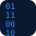

<div align="center">


<br/>

<a href="https://git.io/typing-svg">
  
</a>


<br/><br/>


<br/><br/>

<a href="https://www.linkedin.com/in/kuunal-mistry/"></a>
<a href="mailto:kuunal.mistry.btech2028@atlasskilltech.university"></a>
<a href="https://github.com/KuunalMistry"></a>
<a href="#"></a>

<br/><br/>


</div>

<br/>

---

##  About Me


```yaml
whoami:
  name: "Kuunal Mistry"
  role: "AI/ML Engineer in Training | Full Stack Developer"
  base: "Mumbai, India"
  currently: "B.Tech (AI & ML), Atlas SkillTech University — 2024 to 2028"

focus:
  - Designing and shipping end-to-end ML systems, from EDA to deployment
  - Building recommendation engines and predictive analytics pipelines
  - Full stack product engineering across Python, Flask, and modern web stacks
  - Translating research-grade ML concepts into usable, production-shaped apps

philosophy: >
  I care about systems that hold up outside a notebook —
  clean data pipelines, reproducible models, and interfaces
  people can actually use.
```

**Engineering focus:** I build applied AI/ML systems end-to-end — from data collection and exploratory analysis through model training to a deployed, user-facing product. My work spans classification and recommendation systems, with a growing emphasis on full stack delivery so the models I build are never stranded in a notebook.

**Open To:**

<div align="left">


</div>

<br/>

---

##  Tech Stack

<div align="center">

**Languages**


**Frontend**


**Backend & Databases**


**AI / ML & Data Tooling**


**Cloud, DevOps & Tooling**


</div>

<br/>

---

##  AI / ML Expertise

<div align="center">

| Domain | Proficiency | Details |
|---|:---:|---|
| **Classification Models** |  | Random Forest, Logistic Regression — applied to real-world NASA solar flare data |
| **Recommendation Systems** |  | Content-based & collaborative filtering, cosine similarity, cold-start handling |
| **Exploratory Data Analysis** |  | Pandas-driven EDA, trend visualization, data cleaning & preprocessing |
| **Model Deployment** |  | Flask-based serving of trained ML models to web interfaces |
| **Data Visualization & BI** |  | Power BI dashboards, Pandas/Matplotlib-based analytics reporting |
| **Deep Learning Foundations** |  | TensorFlow fundamentals, building toward neural architectures |

</div>

<br/>

---

##  Featured Projects

<details open>
<summary><b>🛰️ Solar Flare Prediction Website — Predictive Analytics Platform</b></summary>
<br/>

A machine learning system trained on NASA solar activity data to predict solar flare occurrences, paired with a web interface for visualizing predictions and insights.

| Attribute | Detail |
|---|---|
| **Stack** | Python, Pandas, Scikit-learn, Google Colab, HTML/CSS |
| **Scale** | Full NASA space-weather dataset, end-to-end EDA-to-deployment pipeline |
| **Performance** | ~80% classification accuracy (Random Forest / Logistic Regression) |
| **Security** | No sensitive data handling; static prediction interface |
| **Impact** | Demonstrates applied ML on scientific time-series data with a usable front end |
| **Repository** | [github.com/KuunalMistry/solar-flare-prediction](https://github.com/KuunalMistry) |

Built to move beyond a pure notebook exercise: raw NASA data was cleaned and explored with Pandas, trends were visualized to guide feature selection, and classification models were benchmarked before being wrapped in a lightweight web interface so predictions are actually consumable, not just printed to a console.

</details>

<details>
<summary><b>🧭 India Travel Recommendation System — Hybrid Recommender Engine</b></summary>
<br/>

A hybrid recommendation engine for Indian travel destinations, combining content-based and collaborative filtering to generate personalized, cold-start-resilient suggestions.

| Attribute | Detail |
|---|---|
| **Stack** | Python, Pandas, NumPy, Scikit-learn, Flask, Cosine Similarity |
| **Scale** | Multi-feature destination dataset (category, season, ratings, location) |
| **Performance** | 0.72 Precision@5, 0.80 Hit Rate |
| **Security** | Stateless recommendation API, no user PII stored |
| **Impact** | Solves cold-start with a weighted hybrid model; deployed via Flask |
| **Repository** | [github.com/KuunalMistry/india-travel-recommender](https://github.com/KuunalMistry) |

The core engineering challenge was the cold-start problem — new users or destinations with sparse interaction history. A weighted hybrid model blending content-based similarity with collaborative signals was designed and tuned, then served through a Flask API for real-time personalized recommendations.

</details>

<details>
<summary><b>🎓 Atlas Connect — Student Event & Networking Platform</b></summary>
<br/>

A full stack platform for campus event discovery, registration, and networking, built to streamline student engagement at Atlas SkillTech University.

| Attribute | Detail |
|---|---|
| **Stack** | Python, SQL, HTML, CSS, JavaScript |
| **Scale** | Multi-user platform with authentication, event registry, and notifications |
| **Performance** | Real-time event registration and notification handling |
| **Security** | Login/authentication system with SQL-backed user management |
| **Impact** | Centralized campus event discovery, reducing fragmented communication |
| **Repository** | [github.com/KuunalMistry/atlas-connect](https://github.com/KuunalMistry) |

Designed as a full end-to-end product: a Python/SQL backend handles authentication, event registration, and notifications, while a hand-built HTML/CSS/JavaScript frontend delivers the user-facing experience — an early full-stack proof point ahead of deeper ML specialization.

</details>

<br/>

---

##  Experience

**Hackathon Finalist** · IES MCRC Hackathon 3.0
`Analytics · Data Storytelling · Digital Innovation`

Competed as a finalist in a multi-track hackathon spanning analytics, data storytelling, and digital innovation, designing and presenting a data-driven solution under time constraints.

- Built and deployed working ML systems under competition constraints using Python, Flask, and Power BI
- Delivered end-to-end data storytelling — from raw data to a presentable analytical narrative
- Collaborated cross-functionally to ship a working prototype within the hackathon timeline

`Python` `Flask` `Power BI` `Data Storytelling` `Machine Learning`

<br/>

---

##  Achievements

<div align="center">

| Recognition | Details |
|---|---|
| 🏆 **Finalist — IES MCRC Hackathon 3.0** | Recognized across Analytics, Data Storytelling & Digital Innovation tracks |
| 📊 **Applied ML Performance** | Achieved ~80% accuracy on NASA solar flare classification task |
| 🚀 **Deployed ML Systems** | Shipped ML-backed applications using Python, Flask, and Power BI |

</div>

<br/>

---

##  Certifications

<div align="center">

**Python**


**Business Intelligence**


</div>

<br/>

---

##  Coding Profiles

<div align="center">

<a href="#"></a>
<a href="#"></a>
<a href="#"></a>
<a href="#"></a>

</div>

<br/>

---

##  GitHub Analytics

<div align="center">


<br/>


</div>

<br/>

---

##  GitHub Trophies

<div align="center">


</div>

<br/>

---

##  Contribution Activity

<div align="center">


</div>

<br/>

---

##  Contribution Snake

<div align="center">


</div>

<br/>

---

##  Current Focus

```yaml
current_focus:
  learning:
    - Deep Learning fundamentals with TensorFlow
    - Distributed systems design for scalable ML
    - Advanced full stack architecture (React + Flask/Node)

  building:
    - Refining the India Travel Recommendation System toward production
    - Expanding Solar Flare Prediction into a real-time dashboard
    - New full stack AI-powered product concepts

  exploring:
    - MLOps and model deployment pipelines
    - Cloud-native ML serving (GCP / AWS)
    - Open source AI tooling

  open_to:
    - AI/ML Internships
    - Research collaborations
    - Hackathons and applied ML competitions
```

<br/>

---

##  Connect With Me

<div align="center">

<a href="mailto:kuunal.mistry.btech2028@atlasskilltech.university"></a>
<a href="https://www.linkedin.com/in/kuunal-mistry/"></a>
<a href="https://github.com/KuunalMistry"></a>
<a href="#"></a>

</div>

<br/>

---

<div align="center">

*"Models that stay in a notebook don't ship — I build the ones that do."*


</div>
